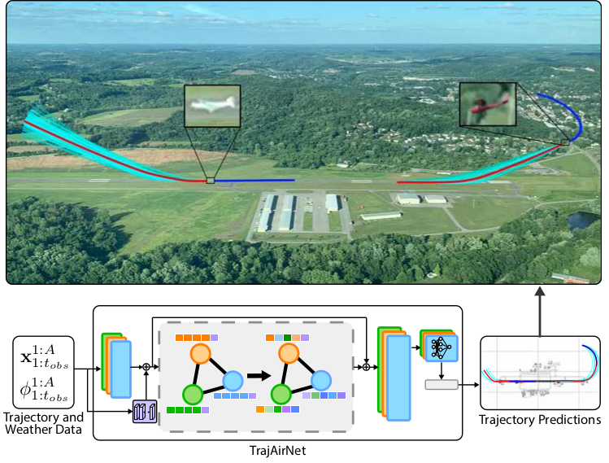

# Predicting Like A Pilot: Dataset and Method to Predict Socially-Aware Aircraft Trajectories in Non-Towered Terminal Airspace

This repository contains the code for the paper submitted to ICRA 2022. 

[**Predicting Like A Pilot: Dataset and Method to Predict Socially-Aware Aircraft Trajectories in Non-Towered Terminal Airspace**]() 

[Jay Patrikar](https://jaypatrikar.me/), [Brady Moon](https://bradymoon.com/), [Jean Oh](https://www.cs.cmu.edu/~./jeanoh/) and [Sebastian Scherer](https://www.ri.cmu.edu/ri-faculty/sebastian-scherer/).


## Brief Overview [[Video]](https://youtu.be/elAQXrxB2gw)



Pilots operating aircraft in un-towered airspace rely on their situational awareness and prior knowledge to predict the future trajectories of other agents. These predictions are conditioned on the past trajectories of other agents, agent-agent social interactions and environmental context such as airport location and weather. This paper provides a dataset, TrajAir, that captures this behavior in a non-towered terminal airspace around a regional airport. We also present a baseline socially-aware trajectory prediction algorithm, TrajAirNet, that uses the dataset to predict the trajectories of all agents. The dataset is collected for 111 days over 8 months and contains ADS-B transponder data along with the corresponding METAR weather data. The data is processed to be used as a benchmark with other publicly available social navigation datasets. To the best of authors’ knowledge, this is the first 3D social aerial navigation dataset thus introducing social navigation for autonomous aviation.TrajAirNet combines state-of-the-art modules in social navigation to provide predictions in a static environment with a dynamic context. 

## Installation

### Environment Setup

First, we'll create a conda environment to hold the dependencies.

```
conda create --name trajairnet --file requirements.txt
conda activate trajairnet
```

### Data Setup

The network uses [TrajAir Dataset](https://theairlab.org/trajair/).

```
cd dataset
wget https://kilthub.cmu.edu/ndownloader/articles/14866251/versions/1
```

Unzip files in place as required.

## TrajAirNet

### Model Training

For training data we can choose between the 4 training subsets of data labelled 7days1, 7days1, 7days1, 7days1 or the entire dataset 111_days. For example, to train with 7days1 use: 

`python train.py --dataset_name 7days1`

Training will use GPUs if available.

Optional arguments can be given as following:

- `--dataset_folder` sets the working directory for data. Default is current working directory (default = `/dataset/`). 
- `--dataset_name` sets the data block to use (default = `7days1`).
- `--obs` observation length (default = `11`).
- `--preds` prediction length (default = `120`).
- `--preds_step` prediction steps (default = `10`).
- `--delim` Delimiter used in data (default = ` `).
- `--lr` Learning Rate (default = `0.001`)
- `--total_epochs` Total number passes over the entire training data set (default = `10`).
- `--evaluate` Test the model at every epoch (default = `True`).
- `--save_model` Save the model at every epoch (default = `True`).
- `--model_pth` Path to save the models (default = `/saved_models/`).


### Model Testing

For testing data we can choose between the 4 testing subsets of data labelled 7days1, 7days2, 7days3, 7days4 or the entire dataset 111_days. For example, to test with 7days1 use: 

`python test.py --dataset_name 7days1 --epoch 1`

Optional arguments can be given as following:

- `--dataset_folder` sets the working directory for data. Default is current working directory (default = `/dataset/`). 
- `--dataset_name` sets the data block to use (default = `7days1`).
- `--obs` observation length (default = `11`).
- `--preds` prediction length (default = `120`).
- `--preds_step` prediction steps (default = `10`).
- `--delim` Delimiter used in data (default = ` `).
- `--model_dir` Path to load the models (default = `/saved_models/`).
- `--epoch` Epoch to load the model. 

### Network Arguments
#### TCN 
- `--input_channels` The number of input channels (x,y,z) (default = `3`).
- `--tcn_kernels` The size of the kernel to use in each convolutional layer (default = `4`).
- `--tcn_channel_size` The number of hidden units to use (default = `256`).
- `--tcn_layers` The number of layers to use. (default = `2`)

#### Context CNN 
- `--num_context_input_c` Number of input channels for context (wx,wy) (default = `2`).
- `--num_context_output_c` Number of output channels for context (wx,wy) (default = `7`).
- `--cnn_kernels`  The size of the kernel to use (default = `2`).
#### GAT 
- `--gat_heads` Number GAT heads (default = `16`).
- `--graph_hidden` The number of hidden units to use (default = `256`).
- `--dropout` Dropout used by the neural network (default = `0.05`).
- `--alpha` Negative step for leakyReLU activation (default = `0.2`).
#### CVAE 
- `--cvae_hidden` The number of hidden units to use (default = `128`).
- `--cvae_channel_size` The number of encoder/decoder units to use (default = `128`).
- `--cvae_layers` The number of layers to use (default = `2`).
- `--mlp_layer`  The number of hidden units in the MLP decoder (default = `32`).


## TrajAir Dataset

More information about TrajAir dataset is avaiable at [link](https://theairlab.org/trajair/).

### TrajAir Dataset processing

Though the processed data is included in the dataset, this repository also contains utilities to process raw data from TrajAir dataset to produce the processed outputs. 

`python adsb_preprocess/process.py --dataset_name 7days1`

Optional arguments can be given as following:

- `--dataset_folder` sets the working directory for data. Default is current working directory (default = `/dataset/`).  
- `--dataset_name` sets the data block to use (default = `7days1`).
- `--weather_folder` directory with weather data (default = `weather_data`).

## Cite
If you have any questions, please contact [jaypat@cmu.edu](mailto:jaypat@cmu.edu) or 
[bradym@andrew.cmu.edu](mailto:bradym@andrew.cmu.edu), or open an issue on this repo. 

If you find this repository useful for your research, please cite the following paper:

```add bib
```

